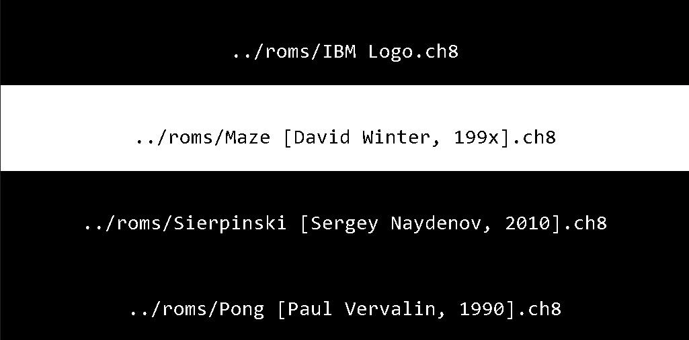

# CrispyChip

[Chip8](https://en.wikipedia.org/wiki/CHIP-8) emulator in C style C++ 
with [SDL2](https://www.libsdl.org/) for rendering/drawing and  [SDL2_ttf](https://github.com/libsdl-org/SDL_ttf) for font display. 
If you want to create your own version check out [This technical reference](http://devernay.free.fr/hacks/chip8/C8TECH10.HTM) by "Cowgod".

You can get CHIP8 roms from here: [ROMS](https://github.com/kripod/chip8-roms)




## Quick Start/Instructions

### Compile/Build

```console
> build.bat
```

### Run

**NOTE**: Make sure all DLLs (`SDL2.dll`, `SDL2_ttf.dll`) and `Consolas.ttf` are in the same place as `CrispyChip.exe`

```console
> cd build
> CripsyChip.exe "../roms/[ROM]" 
```

### Alternatively

To launch the emulator with a simple select menu:

```console
> cd build
> CrispyChip.exe
```